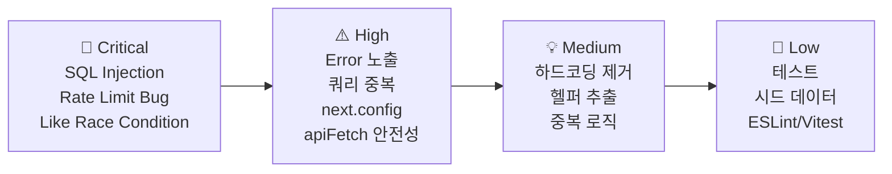

# 🔍 Multi FreeBoard Codex — 코드 레벨 상세 리뷰

> **리뷰일**: 2026-02-17 | **대상**: 전체 소스 45개 파일 + SQL 마이그레이션 3개

---

## 📊 전체 평가 요약

| 영역 | 점수 | 핵심 코멘트 |
|------|------|-------------|
| 프로젝트 구조 | ⭐⭐⭐⭐ | 깔끔한 레이어 분리, 적절한 디렉토리 설계 |
| 타입 안전성 | ⭐⭐⭐⭐ | Zod 스키마 + TS 타입 잘 분리 |
| API 설계 | ⭐⭐⭐☆ | 일관적이나 중복 코드와 개선 여지 존재 |
| 보안 | ⭐⭐⭐☆ | RLS + 서버 권한 분리 좋으나 SQL Injection 위험 1건 |
| DB 설계 | ⭐⭐⭐⭐ | 트리거/RLS/인덱스가 체계적 |
| 프론트엔드 | ⭐⭐⭐☆ | 기능적이나 [apiFetch](file:///Users/hwanchoi/projects_202602/multi_freeboard_codex/src/lib/client-api.ts#17-34) 미활용, 컴포넌트 분리 부족 |
| 테스트 | ⭐⭐☆☆ | 테스트 파일 2개만 존재, 커버리지 매우 낮음 |

---

## 🚨 Critical — 즉시 수정 필요

### 1. SQL Injection 취약점 (admin users 검색)

[route.ts](file:///Users/hwanchoi/projects_202602/multi_freeboard_codex/src/app/api/admin/users/route.ts#L32)에서 사용자 입력(`q`)을 필터링 없이 직접 `.or()` 쿼리에 삽입합니다.

```typescript
// ❌ 현재 코드 — SQL Injection 위험
if (q) {
  query = query.or(`email.ilike.%${q}%,nickname.ilike.%${q}%`);
}
```

> [!CAUTION]
> `q` 값에 `%`, `_`, 쉼표(`,`), 괄호([()](file:///Users/hwanchoi/projects_202602/multi_freeboard_codex/src/lib/api/response.ts#3-6)) 등의 특수문자를 넣으면 PostgREST 필터를 조작할 수 있습니다. 관리자 전용 API이지만 원칙적으로 위험합니다.

```diff
// ✅ 개선안 — 특수문자 이스케이프 또는 개별 필터 사용
-if (q) {
-  query = query.or(`email.ilike.%${q}%,nickname.ilike.%${q}%`);
-}
+if (q) {
+  const escaped = q.replace(/[%_]/g, '\\$&');
+  query = query.or(`email.ilike.%${escaped}%,nickname.ilike.%${escaped}%`);
+}
```

---

### 2. 좋아요 토글 Race Condition

[like/route.ts](file:///Users/hwanchoi/projects_202602/multi_freeboard_codex/src/app/api/posts/%5BpostId%5D/like/route.ts#L29-L57)에서 `SELECT → DELETE/INSERT` 패턴이 원자적이지 않습니다.

```typescript
// ❌ 두 요청이 동시에 들어오면 중복 insert 또는 이중 delete 가능
const { data: existing } = await admin
  .from("post_likes").select(...).eq(...).maybeSingle();

if (existing) { /* delete */ } else { /* insert */ }
```

> [!WARNING]
> 동시 요청 시 토글 로직이 깨질 수 있습니다. `UPSERT` + `ON CONFLICT` DB 함수로 원자적 처리 권장.

```sql
-- ✅ 개선안 — 원자적 토글 RPC
CREATE FUNCTION toggle_post_like(p_post_id uuid, p_user_id uuid)
RETURNS boolean LANGUAGE plpgsql AS $$
DECLARE v_existed boolean;
BEGIN
  DELETE FROM post_likes WHERE post_id = p_post_id AND user_id = p_user_id;
  GET DIAGNOSTICS v_existed = ROW_COUNT > 0;  -- Not exists, so it was deleted
  IF NOT FOUND THEN
    INSERT INTO post_likes(post_id, user_id) VALUES (p_post_id, p_user_id);
    RETURN true;  -- liked
  END IF;
  RETURN false;  -- unliked
END;
$$;
```

---

### 3. Rate Limit에 `login` 항목이 `signup` 한도 사용

[rate-limit.ts](file:///Users/hwanchoi/projects_202602/multi_freeboard_codex/src/lib/api/rate-limit.ts#L12) — `login`의 max 값이 `rateLimitMaxSignup`으로 잘못 매핑되어 있습니다.

```typescript
// ❌ 현재 코드
const maxByAction: Record<RateLimitAction, number> = {
  signup: env.rateLimitMaxSignup,
  login: env.rateLimitMaxSignup,  // 🐛 signup 한도를 재사용!
  ...
};
```

```diff
// ✅ 수정
-  login: env.rateLimitMaxSignup,
+  login: env.rateLimitMaxLogin ?? env.rateLimitMaxSignup,
```

> 별도 `RATE_LIMIT_MAX_LOGIN` 환경변수 추가도 필요합니다.

---

## ⚠️ High — 가까운 시일 내 개선 권장

### 4. 게시글 목록 API의 관리자 쿼리 중복 구성

[boards/[slug]/posts/route.ts](file:///Users/hwanchoi/projects_202602/multi_freeboard_codex/src/app/api/boards/%5Bslug%5D/posts/route.ts#L46-L75) — 일반 사용자용 쿼리를 만든 뒤, 관리자인 경우 **전체 쿼리를 처음부터 다시 구성**합니다.

```typescript
// ❌ 46~55줄에서 쿼리를 만든 후, 61~74줄에서 관리자면 쿼리를 다시 생성
let query = admin.from("posts").select(...)
  .eq("status", "published")  // 일반
  ...

if (viewer?.isAdmin) {
  query = admin.from("posts").select(...)  // 전체 재구성 (status 필터 없음)
  ...
}
```

```diff
// ✅ 개선안 — 조건부 status 필터
let query = admin.from("posts").select("*", { count: "exact" })
  .eq("board_id", board.id)
  .is("deleted_at", null)
  .order("is_notice", { ascending: false })
  .order("is_pinned", { ascending: false })
  .order("created_at", { ascending: false })
  .range((page - 1) * PAGE_SIZE, page * PAGE_SIZE - 1);

-if (viewer?.isAdmin) { /* 전체 쿼리 재구성 */ }
+if (!viewer?.isAdmin) {
+  query = query.eq("status", "published");
+}

if (queryText) {
  query = query.textSearch("search_tsv", queryText, { ... });
}
```

---

### 5. [getSupabaseAdminClient()](file:///Users/hwanchoi/projects_202602/multi_freeboard_codex/src/lib/supabase/server.ts#16-27) 매 호출마다 새 인스턴스 생성

[server.ts](file:///Users/hwanchoi/projects_202602/multi_freeboard_codex/src/lib/supabase/server.ts#L16-L26) — 서버 클라이언트는 매번 `createClient()`를 호출합니다. 한 요청 내에서 여러 번 호출되면 불필요한 객체 생성이 반복됩니다.

```typescript
// ❌ 현재: 매번 새 인스턴스
export function getSupabaseAdminClient() {
  const { url } = getPublicEnv();
  const { serviceRoleKey } = getServerEnv();
  return createClient(url, serviceRoleKey, { ... });
}
```

> [!TIP]
> 서버 Route Handler 내부에서 같은 요청 처리 중 3-5회 반복 호출됩니다. 요청 범위 싱글턴 또는 모듈 스코프 캐싱을 고려하세요.

```typescript
// ✅ 개선안 — 모듈 스코프 싱글턴
let adminClient: ReturnType<typeof createClient> | null = null;

export function getSupabaseAdminClient() {
  if (adminClient) return adminClient;
  const { url } = getPublicEnv();
  const { serviceRoleKey } = getServerEnv();
  adminClient = createClient(url, serviceRoleKey, {
    auth: { persistSession: false, autoRefreshToken: false },
  });
  return adminClient;
}
```

---

### 6. [apiFetch](file:///Users/hwanchoi/projects_202602/multi_freeboard_codex/src/lib/client-api.ts#17-34) 응답 타입 안전성 부족 + `response.json()` 무조건 호출

[client-api.ts](file:///Users/hwanchoi/projects_202602/multi_freeboard_codex/src/lib/client-api.ts#L17-L33) — HTTP 에러(500, 네트워크 오류 등) 시 `response.json()`이 실패할 수 있습니다.

```typescript
// ❌ 현재 코드
const response = await fetch(input, { ... });
return response.json();  // 비-JSON 응답 시 크래시
```

```diff
// ✅ 개선안 — 안전한 JSON 파싱
const response = await fetch(input, { ... });
+if (!response.ok) {
+  try {
+    return await response.json();
+  } catch {
+    return { ok: false, error: { message: `HTTP ${response.status}` } };
+  }
+}
return response.json();
```

---

### 7. [next.config.ts](file:///Users/hwanchoi/projects_202602/multi_freeboard_codex/next.config.ts)가 비어 있음

[next.config.ts](file:///Users/hwanchoi/projects_202602/multi_freeboard_codex/next.config.ts) — 보안/성능 관련 설정이 전혀 없습니다.

```typescript
// ✅ 추가 권장 설정
const nextConfig: NextConfig = {
  poweredByHeader: false,            // X-Powered-By 헤더 제거
  reactStrictMode: true,             // React strict mode
  serverExternalPackages: [],
  images: { domains: [] },
  headers: async () => [             // 보안 헤더
    { source: '/(.*)', headers: [
      { key: 'X-Frame-Options', value: 'DENY' },
      { key: 'X-Content-Type-Options', value: 'nosniff' },
    ]},
  ],
};
```

---

### 8. [handleRouteError](file:///Users/hwanchoi/projects_202602/multi_freeboard_codex/src/lib/api/errors.ts#3-26) — 모든 알 수 없는 Error는 400으로 응답

[errors.ts](file:///Users/hwanchoi/projects_202602/multi_freeboard_codex/src/lib/api/errors.ts#L21) — 매치되지 않는 [Error](file:///Users/hwanchoi/projects_202602/multi_freeboard_codex/src/lib/api/errors.ts#3-26)를 400(Bad Request)으로 처리합니다.

```typescript
// ❌ Supabase 내부 오류도 400으로 노출됨
return fail(400, error.message);
```

> [!WARNING]
> DB 에러, 내부 로직 에러가 그대로 클라이언트에 노출됩니다. 에러 메시지에 DB 스키마 정보가 포함될 수 있습니다.

```diff
// ✅ 알려진 에러만 400, 나머지는 500
+const knownErrors = ['Invalid JSON body', 'Invalid slug base'];
 if (error instanceof Error) {
-  return fail(400, error.message);
+  if (knownErrors.includes(error.message)) {
+    return fail(400, error.message);
+  }
+  console.error('[RouteError]', error);
+  return fail(500, 'Internal server error');
 }
```

---

## 💡 Medium — 코드 품질 개선

### 9. 홈 페이지가 `freeboard` 슬러그를 하드코딩

[page.tsx](file:///Users/hwanchoi/projects_202602/multi_freeboard_codex/src/app/page.tsx#L43) — 홈 페이지에서 최신 글을 `freeboard` 보드 고정으로 가져옵니다.

```typescript
const feedRes = await fetch("/api/boards/freeboard/posts?page=1", ...);
```

> 동적으로 모든 보드의 최신 글을 가져오거나, 환경변수로 기본 보드를 설정 가능하게 해야 합니다.

---

### 10. TopNav에 보드 링크 하드코딩

[top-nav.tsx](file:///Users/hwanchoi/projects_202602/multi_freeboard_codex/src/components/top-nav.tsx#L37-L42) — 네비게이션에 `freeboard`, `ai-freeboard` 경로가 하드코딩되어 있습니다.

```tsx
<Link href="/b/freeboard">테크 뉴스</Link>
<Link href="/b/ai-freeboard">AI 게시판</Link>
```

> 보드 목록을 API에서 가져와 동적 렌더링하면 관리자가 보드를 추가/삭제해도 자동 반영됩니다.

---

### 11. [createModerationLog](file:///Users/hwanchoi/projects_202602/multi_freeboard_codex/src/lib/api/moderation.ts#3-19)의 에러가 무시됨

[moderation.ts](file:///Users/hwanchoi/projects_202602/multi_freeboard_codex/src/lib/api/moderation.ts#L11) — insert 결과의 error를 체크하지 않습니다.

```typescript
// ❌ 현재: 에러 무시
await admin.from("moderation_actions").insert({ ... });
```

```diff
// ✅ 에러 핸들링 추가
-await admin.from("moderation_actions").insert({ ... });
+const { error } = await admin.from("moderation_actions").insert({ ... });
+if (error) {
+  console.error('[ModerationLog] Failed:', error);
+}
```

---

### 12. `updated_at` 타임스탬프가 `new Date().toISOString()` 사용

[posts/[postId]/route.ts](file:///Users/hwanchoi/projects_202602/multi_freeboard_codex/src/app/api/posts/%5BpostId%5D/route.ts#L170-L174) — `deleted_at`에 JS Date을 사용합니다.

> DB 트리거(`set_updated_at`)가 있는 `updated_at`과 달리, `deleted_at`은 서버 사이드 타임스탬프를 사용합니다. **서버와 DB 시간대 불일치** 가능성이 있습니다.

```diff
// ✅ DB 함수 사용 개선안
-deleted_at: new Date().toISOString(),
+deleted_at: 'now()',  // 또는 DB 트리거로 처리
```

---

### 13. [ensureProfile](file:///Users/hwanchoi/projects_202602/multi_freeboard_codex/src/lib/api/auth.ts#21-51)과 `handle_new_user_profile` 트리거 중복

- [auth.ts](file:///Users/hwanchoi/projects_202602/multi_freeboard_codex/src/lib/api/auth.ts#L21-L50)의 [ensureProfile()](file:///Users/hwanchoi/projects_202602/multi_freeboard_codex/src/lib/api/auth.ts#21-51): 서버에서 프로필을 생성
- DB 트리거 `handle_new_user_profile`: `auth.users` INSERT 시 자동 생성

> 두 곳에서 프로필 생성 로직이 중복됩니다. 닉네임 생성 로직도 다릅니다.

---

### 14. 게시글 삭제 시 `deleted_at` + `status='deleted'` 이중 관리

소프트 삭제 시 `deleted_at` 타임스탬프와 `status` 컬럼을 동시에 변경합니다. 조회 시에도 두 필드를 모두 확인합니다.

```typescript
// 조회: .is("deleted_at", null) + .eq("status", "published")
// 삭제: status = "deleted" + deleted_at = now()
```

> 하나의 필드로 통일하면 쿼리가 단순해지고 실수 가능성이 줄어듭니다.

---

### 15. 공통 반복 패턴이 헬퍼로 분리되지 않음

여러 route에서 반복되는 패턴:
- 파라미터 파싱 (`paramsSchema.parse(await context.params)`)
- 인증 + 정지 확인 ([requireAuth](file:///Users/hwanchoi/projects_202602/multi_freeboard_codex/src/lib/api/auth.ts#79-87) + [assertNotSuspended](file:///Users/hwanchoi/projects_202602/multi_freeboard_codex/src/lib/api/auth.ts#88-98))
- 레이트리밋 체크 (user + ip 2회 호출)
- 권한 검사 (`author_id !== ctx.userId && !ctx.isAdmin`)

```typescript
// ✅ 미들웨어 패턴으로 추출 가능
async function withAuth<T>(
  request: Request,
  handler: (ctx: AuthContext) => Promise<T>
) {
  try {
    const ctx = await requireAuth(request.headers);
    return await handler(ctx);
  } catch (error) {
    return handleRouteError(error);
  }
}
```

---

## 📝 Low — 나중에 개선해도 좋은 항목

| # | 항목 | 파일 | 설명 |
|---|------|------|------|
| 16 | 테스트 커버리지 부족 | [slug.test.ts](file:///Users/hwanchoi/projects_202602/multi_freeboard_codex/src/lib/api/slug.test.ts), [netlify.test.ts](file:///Users/hwanchoi/projects_202602/multi_freeboard_codex/src/lib/api/netlify.test.ts) | API route, auth, rate-limit 등 핵심 로직 테스트 없음 |
| 17 | [AuthProvider](file:///Users/hwanchoi/projects_202602/multi_freeboard_codex/src/components/auth-provider.tsx#19-82)에서 `getSession()` 사용 | [auth-provider.tsx](file:///Users/hwanchoi/projects_202602/multi_freeboard_codex/src/components/auth-provider.tsx) | Supabase에서 `getSession()`보다 `getUser()` 권장 |
| 18 | [globals.css](file:///Users/hwanchoi/projects_202602/multi_freeboard_codex/src/app/globals.css) 리뷰 미포함 | [globals.css](file:///Users/hwanchoi/projects_202602/multi_freeboard_codex/src/app/globals.css) | CSS 변수/유틸 클래스 일관성 확인 필요 |
| 19 | [seed.sql](file:///Users/hwanchoi/projects_202602/multi_freeboard_codex/supabase/seed.sql)이 거의 비어있음 | [supabase/seed.sql](file:///Users/hwanchoi/projects_202602/multi_freeboard_codex/supabase/seed.sql) | 개발/테스트용 시드 데이터 부족 |
| 20 | 관리자 API에 페이지네이션 미구현 | [admin/reports/route.ts](file:///Users/hwanchoi/projects_202602/multi_freeboard_codex/src/app/api/admin/reports/route.ts) | 신고 목록 등이 전체 반환될 가능성 |
| 21 | [eslint.config.mjs](file:///Users/hwanchoi/projects_202602/multi_freeboard_codex/eslint.config.mjs) 커스텀 룰 없음 | [eslint.config.mjs](file:///Users/hwanchoi/projects_202602/multi_freeboard_codex/eslint.config.mjs) | `no-console` 등 프로덕션 규칙 미설정 |
| 22 | [vitest.config.ts](file:///Users/hwanchoi/projects_202602/multi_freeboard_codex/vitest.config.ts) 커버리지 미설정 | [vitest.config.ts](file:///Users/hwanchoi/projects_202602/multi_freeboard_codex/vitest.config.ts) | `coverage` 옵션 추가 권장 |
| 23 | `profileUpdateSchema`에 한글 닉네임 불허 | [schemas.ts](file:///Users/hwanchoi/projects_202602/multi_freeboard_codex/src/types/schemas.ts) | `regex(/^[a-zA-Z0-9_]+$/)` — 한국어 서비스에 적합한지 검토 |
| 24 | `board_templates` 테이블 미활용 | 마이그레이션 | 클론 API에서 `template_id` 참조만 있고 생성 API 없음 |
| 25 | IP `"unknown"` 폴백이 레이트리밋 우회 가능 | [netlify.ts](file:///Users/hwanchoi/projects_202602/multi_freeboard_codex/src/lib/api/netlify.ts) | 같은 IP로 집계되어 DoS 가능 |

---

## 🏗️ 우선순위 개선 로드맵



---

## ✅ 잘 되어 있는 점

- **프로젝트 구조**: `lib/api`, `lib/supabase`, `types`, `components` 등 레이어 분리가 깔끔
- **Zod 스키마 검증**: 모든 입력을 체계적으로 검증하고 있음
- **RLS 정책**: 10개 테이블 모두 RLS ON, 세밀한 정책 설계
- **DB 트리거 활용**: 카운터 갱신, 검색 벡터, 대댓글 depth 제한이 모두 DB 레벨
- **소프트 삭제 일관성**: 게시글, 댓글, 보드 모두 소프트 삭제 정책 적용
- **레이트리밋 아키텍처**: IP + 사용자 이중 체크, DB 기반 슬라이딩 윈도우
- **관리자 부트스트랩**: 1회성 승격 방식이 깔끔하고 안전
